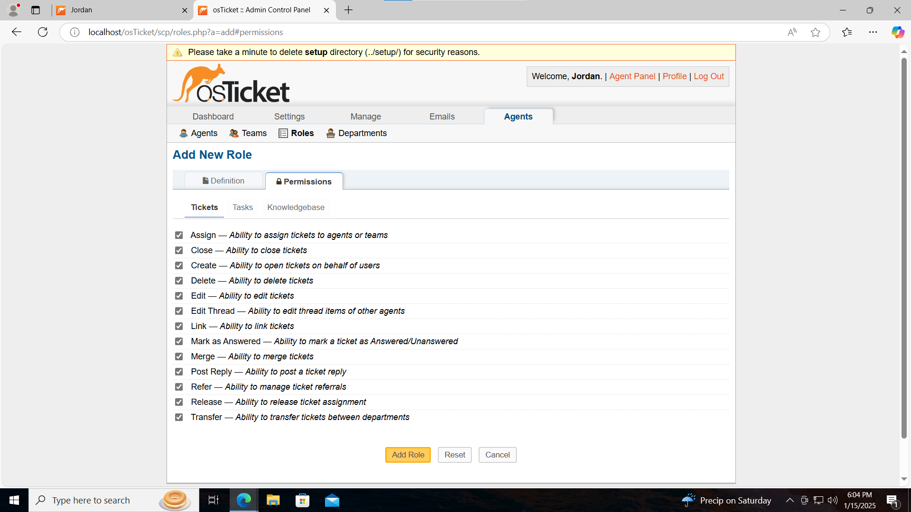
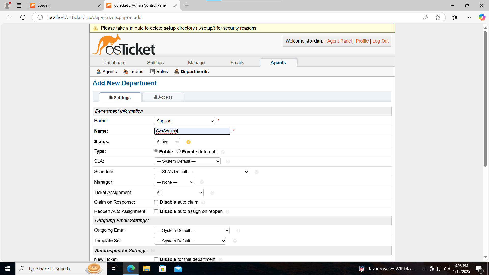
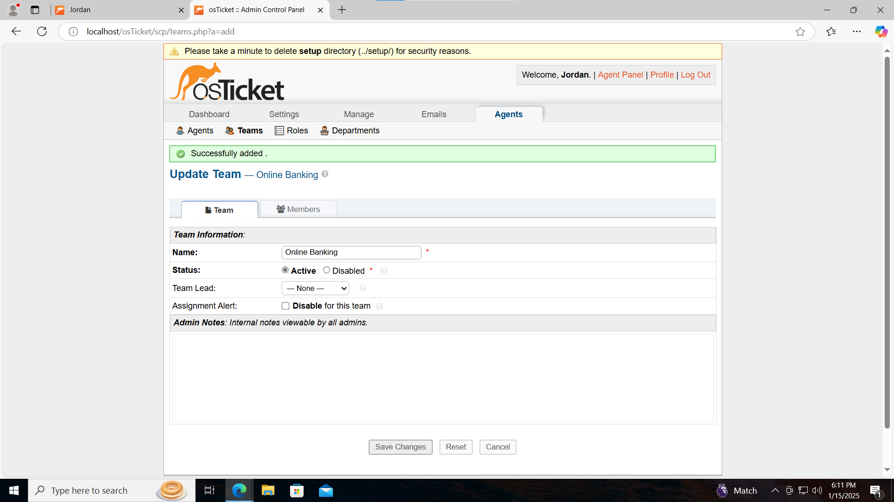
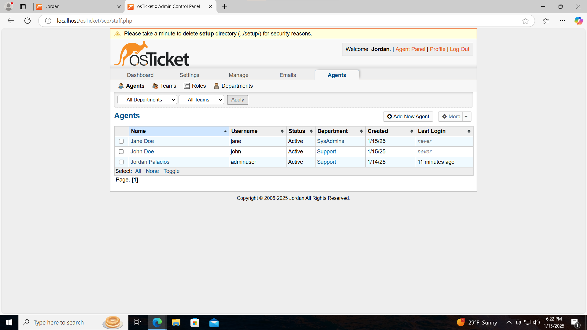
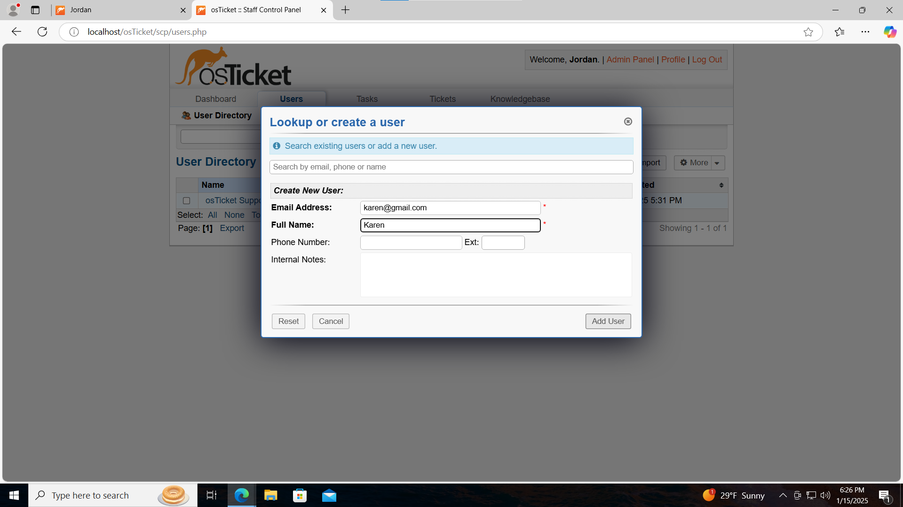
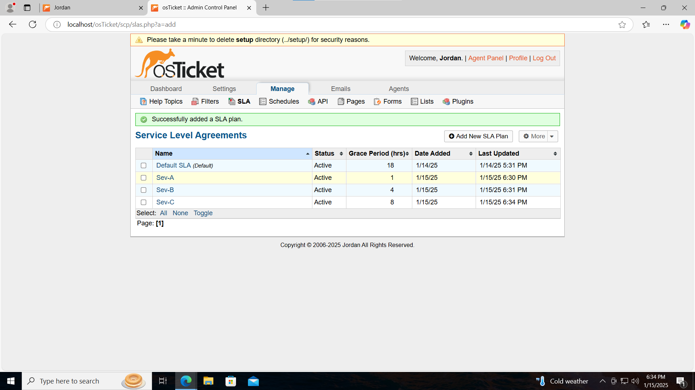
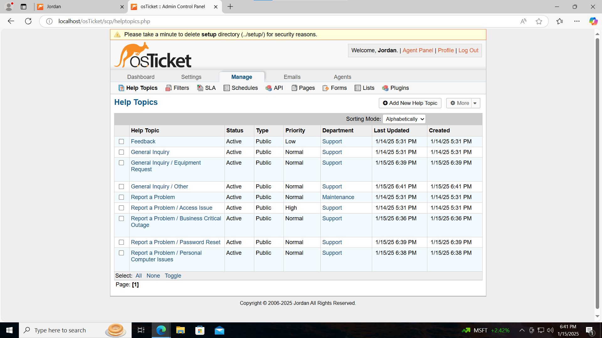

<h1>osTicket - Post-Install Configuration</h1>
This tutorial outlines the post-install configuration of the open-source help desk ticketing system osTicket. 

<h2>Environments and Technologies Used</h2>

- Microsoft Azure (Virtual Machines/Compute)
- Remote Desktop
- Internet Information Services (IIS)

<h2>Operating Systems Used </h2>

- Windows 10</b> (21H2)

<h2>Post-Install Configuration Objectives</h2>

- Configure Roles
- Configure Departments
- Configure Teams
- Configure Agents
- Configure Users
- Configure SLA
- Configure Help topics
<h2>Configuration Steps</h2>

Go to Admin Panel, Agents, Roles and click add New Role. Create a role named Supreme Admin and go to Permissions and check all boxes under Tickets and then under Task.
Click Add role at the bottom

 

While in Admin Panel go to Agents, then Departments and click Add Department and Name it SysAdmins

 

While in Admin Panel go to Agents, Teams and click Add New Team and name it Online Banking 

While in Admin panel go to agents and click add new. The name of the first agent will be Jane Doe and put her in the SysAdmins department and make sure her role is Supreme Admin. For her team she will be a part of the online banking team.
For the next agent we will add John Doe and for his department we will put him under support and view only and then under teams put him under level 1 support.

Go back to Agent Panel and go to user tab. Click add new user and add Karen

  

Go to Admin Panel, Manage, and SLA
Add the following: Sev-A:Grace period 1 hour,24/7, Sev-B:Grace period 4 hours,24/7 and last Sev-C:Grace period 8 hours, Buisness hours

  

Go to Admin Panel
Go to Manage and then Help Topcs. Add the following new Help Topics, Buisiness Critical Outage, Personal Computer Issues, Equitment Request, Password Reset, and Other

 
